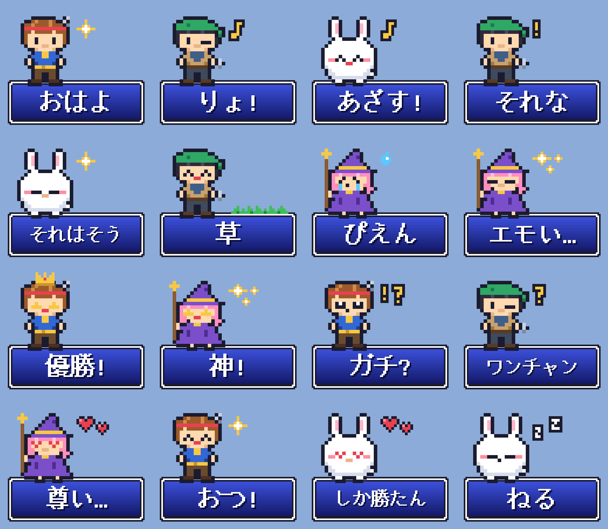
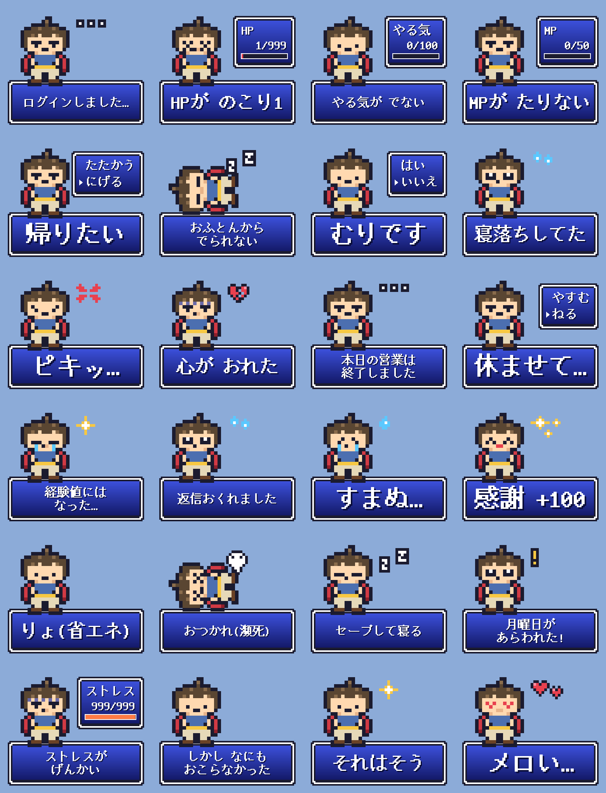
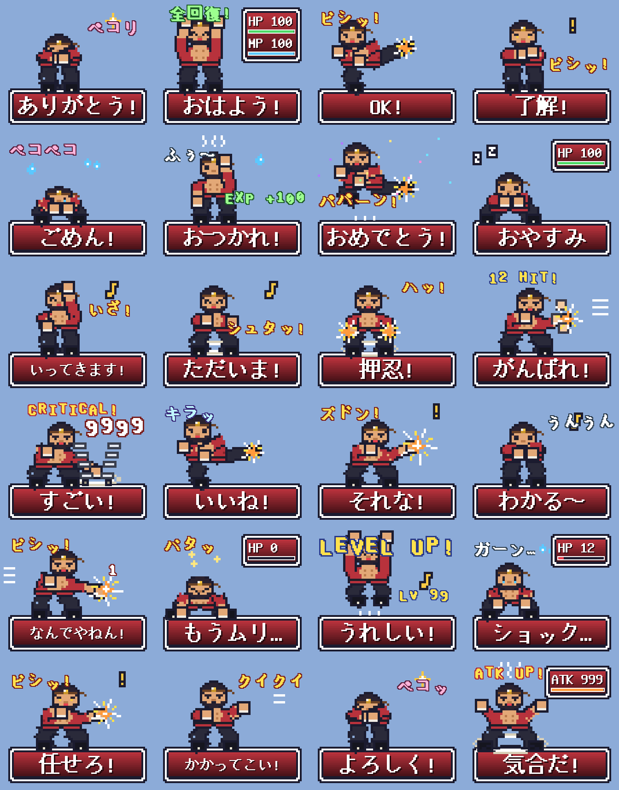
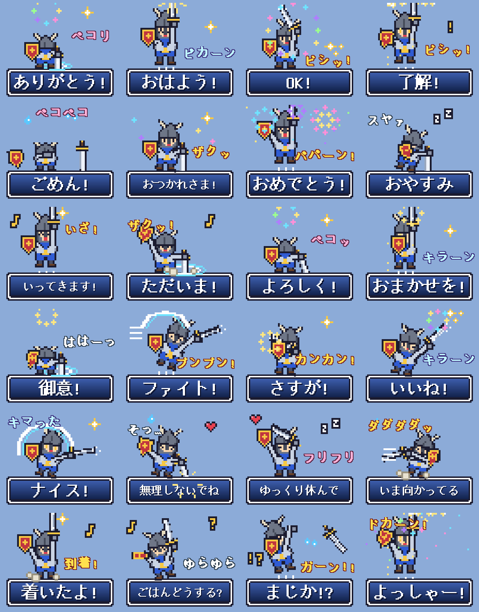
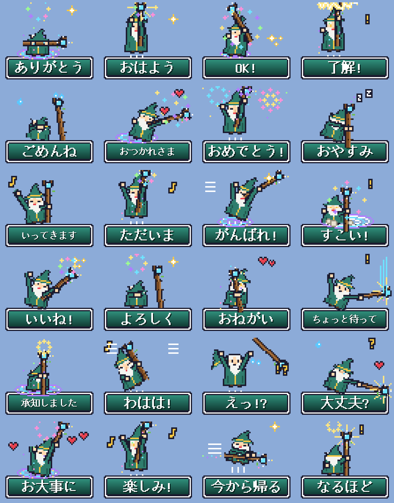
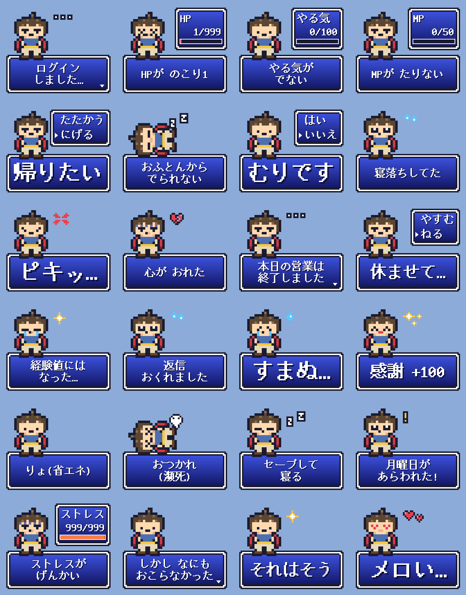
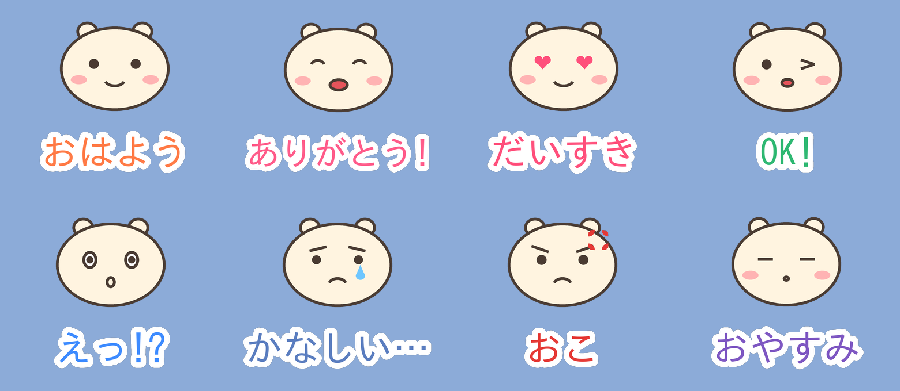

# line-stamp

LINE Creators Market に提出できる **LINEスタンプ画像を自動生成** するツールです。

## ドット絵 RPG 風スタンプ (pixel_stamps.py)

16bit 時代の RPG 風オリジナルキャラ 4 人 (剣士ユウ・魔法使いミラ・シーフのカイ・マスコットのもふ) と、
メッセージウィンドウ風の吹き出しで、流行りの言葉スタンプ 16 枚を作ります。



```bash
pip install -r requirements.txt
python3 pixel_stamps.py          # pixel_stamps.json から生成
```

→ `output_pixel/` に 01〜16.png・main.png・tab.png、提出用 `pixel_party_stamp.zip`、確認用 `preview_pixel.png` ができます。

### pixel_stamps.json の書き方

```json
{ "chara": "kai", "text": "草", "expression": "happy", "effects": ["grass"], "pos": "left" }
```

- **`chara`**: `yusha` (やる気ゼロ勇者) / `yuu` (剣士) / `mira` (魔法使い) / `kai` (シーフ) / `mofu` (マスコット)
- **`expression`**: `normal` `smile` `happy` `wink` `calm` `sleep` `angry` `sad` `love` `kira` `surprised`
- **`effects`**: `exclaim` `question` `exclaim_q` `heart` `hearts` `sparkle` `sparkles` `sweat` `zzz` `anger` `note` `crown` `grass`
  - 位置や大きさを変えたいときは `{"name": "heart", "dx": 10, "dy": -5, "scale": 8}`
- **`pos`**: キャラの位置 `left` / `center` / `right`、**`flip`**: `true` で左右反転
- `window` で吹き出しの色 (上下のグラデーション・文字・影) を変えられます
- キャラのドット絵や表情・エフェクトは `sprites.py` に文字で描いてあるので、直接編集して増やせます

### フォント

文字は GNU Unifont (ドット絵フォント) の `unifont_jp.otf` で描きます。
Linux では `fonts-unifont` パッケージで入ります。Mac / Windows では
<https://unifoundry.com/unifont/> から `unifont_jp-*.otf` をダウンロードし、
`fonts/unifont_jp.otf` という名前で置いてください。

## やる気ゼロ勇者スタンプ (yusha_stamps.json)

HP1・やる気ゼロの勇者が、ステータス画面やコマンド選択で「言いにくい気持ち」を代わりに言ってくれる 24 枚セット。



```bash
python3 pixel_stamps.py -c yusha_stamps.json   # → output_yusha/ と yusha_stamp.zip
```

pixel_stamps.json の項目に加えて、次のものが使えます。

- **`panel`**: キャラの右に出すミニウィンドウ
  - ステータス: `{"type": "status", "rows": [{"label": "HP", "value": 1, "max": 999, "color": "#E8414F"}]}`
  - コマンド選択: `{"type": "menu", "options": ["たたかう", "にげる"], "cursor": 1}`
- **`pose`**: `"down"` で倒れたポーズ
- 表情の追加: `tired` (半目) `dead` (×目) `blank` (真顔) `gloomy` (どんより) `cry`
- エフェクトの追加: `vein` (怒りマーク) `broken_heart` `sweats` `ellipsis` (…) `soul` (魂が抜ける)

## 武闘家 動くスタンプ (martial_anim.py)

ゴツい武闘家 (日焼けした肌・太い眉・あごひげ・胸元を開けた道着) がパンチとキックで全身を使って動く 24 個。
RPG らしい数字のアニメを合うスタンプにだけ入れています (連打の HIT 数・CRITICAL! 9999・ツッコミのダメージ 1・
HP が 0 まで減る / 寝て回復する・朝に HP と MP が満タンになる・-9999 のダメージ・EXP +100・LEVEL UP!・ATK が上がる)。
どのスタンプも、セリフのあと RPG のメッセージ送り (▼) で「オチの一言」に切り替わります
(例: うれしい! → Lv99(自称)、よろしく! → マジで宜しく!)。オチは `martial_stamps.json` の `after` で変えられます。
一覧に出る 1 コマ目はメインのセリフのままで、オチを読めるよう 4 秒の 1 回再生にそろえています。魔法使い・戦士の人形に **脚の部品** を加え、腰から足先までを
ひざで曲げて描く (太もも・すねの長さから ひざの位置を求める) ので、ハイキック・回し蹴り・飛び蹴りもできます。
体を傾けるときはドット絵を回転させず、頭・胸・腰のかたまりを横にずらして顔の形を保ちます。
拳や足先が大きく動いたコマには風を切る筋、打撃の瞬間には放射状の線と星、連打には拳の残像が出ます。
セリフは定番の上位 10 語に、共感 (それな!・わかる〜)・素直な気持ち (もうムリ…・ショック…・うれしい!)・
ツッコミ (なんでやねん!)・武闘家らしい言葉 (押忍!・かかってこい!・気合だ!) を加えています。



```bash
python3 martial_anim.py           # martial_stamps.json → output_martial/ と martial_anim_stamp.zip
```

## 剣と盾の戦士 動くスタンプ (warrior_anim.py)

剣と盾を持った戦士が、剣を振り回し盾を構えて全身で動く 24 個。魔法使いと同じ人形の仕組みですが、
魔法の表現は使わず、素振り・突き・袈裟斬り・十字斬り・回転斬り・納刀 (チャキン)・盾での体当たりなど剣士の動きで構成。
斬撃 (白と鋼色の三日月)・斬り跡・金属の火花・刃のきらめき・残像・土ぼこりで表現します。
地面に突き立てた剣は地面の下が隠れます。
セリフは定番の上位 10 語に、30〜40 代に人気の気づかい・実用の言葉 (無理しないでね・着いたよ・ごはんどうする?) と
面白い返し (御意!・まじか!?) を加えています。



```bash
python3 warrior_anim.py           # warrior_stamps.json → output_warrior/ と warrior_anim_stamp.zip
```

## 杖の魔法使い 動くスタンプ (wizard_anim.py)

杖をついたおじいさん魔法使いが、杖を使って全身で大きく動く 24 個。
セリフは「よく使われる言葉ランキング」上位 (ありがとう・おはよう・OK・ごめんね・了解・おつかれさま・おめでとう・おやすみ…) が中心です。



```bash
python3 wizard_anim.py            # wizard_stamps.json → output_wizard/ と wizard_anim_stamp.zip
```

キャラを 体 / 腕 / 杖 の部品に分けた人形として描き、コマごとに
ジャンプ・おじぎ・体の傾き・伸び縮み・空中回転・手の位置・杖の角度を変えています (1 ドット = 5px)。
杖は木目と節のある木の杖で、振ると宝玉が光の軌跡を残します。
魔法陣・稲妻・光の輪・立ちのぼる光の粒・花火・衝撃波などの魔法表現も付きます。

LINE のクリエイターズスタンプには音を付けられないので、代わりに「ドーン!!」「ビシッ!」「キラーン」などの
擬音をドット文字で入れています。`wizard_stamps.json` の `sfx` で、言葉・色 (`impact` / `magic` / `cute` / `calm`)・
位置 (ドット単位の x, y)・出すコマの範囲 (`frames`) を指定します。範囲の最初のコマでは一回り大きく飛び出します。
動きは `wizard_anim.py` の `m_thanks` などの関数で決めていて、`wizard_stamps.json` の `motion` で選びます。

## 動くスタンプ (anim_stamps.py)

やる気ゼロ勇者の 24 枚を、LINE のアニメーションスタンプ (APNG) にしたもの。
ゲージが減る・カーソルが迷う・倒れて魂が抜ける・文字が 1 文字ずつ出る、などの動きが付きます。



```bash
python3 anim_stamps.py            # anim_stamps.json → output_anim/ と yusha_anim_stamp.zip
```

各スタンプの `anim` で動きを選びます。

| type | 動き | 主なオプション |
| --- | --- | --- |
| `drain` | ステータスのゲージが減っていく | `from` (開始値), `from_expression` |
| `cursor` | コマンドのカーソルが迷ってから決まる | `from` (最初の選択肢), `from_expression` |
| `fall` | よろけて倒れる (`pose: down` と一緒に) | `from_expression` |
| `type` | RPG のように 1 文字ずつ表示 → ▼ が点滅 | `seconds` |
| `shake` | ぶるぶる震える | `pulse` (エフェクト点滅) |
| `hop` | ぴょんと跳ねる | `heart` (エフェクトがドキドキ) |
| `blink` | ときどきまばたき | `blink` (閉じた時の表情), `at` |
| `bob` | エフェクトがふわふわ | `body: "breath"` (寝息) |
| `drip` | 汗がたらーっと流れる | |
| `soul` | 魂が抜けていく | |

生成後に LINE の仕様を自動チェックします (320x270 以内・5〜20 フレーム・ループ 1〜4 回・
再生時間 1/2/3/4 秒ちょうど・300KB 以下・8/16/24 個)。
LINE では 1 フレーム目が一覧やサムネイルに静止画として出るので、どの動きも 1 フレーム目は完成形にしてあります。
メイン画像 (240x240) はまばたきする APNG、タブ画像は静止画です。

## イラスト + 文字のスタンプ (make_stamps.py)

`stamps.json` に「セリフ」と「表情」を書くだけで、丸いキャラのスタンプや、自作イラストに文字を入れたスタンプを作ります。



```bash
python3 make_stamps.py
```

生成されるもの:

| ファイル | 内容 |
| --- | --- |
| `output/01.png` 〜 | スタンプ画像 (最大 370×320px・偶数px・背景透過・余白 10px) |
| `output/main.png` | メイン画像 (240×240px) |
| `output/tab.png` | トークルームタブ画像 (96×74px) |
| `mochi_stamp.zip` | 上記をまとめた提出用 ZIP |
| `preview.png` | 確認用の一覧画像 (LINE のトーク背景風) |

生成後に自動で仕様チェック (サイズ・偶数px・透過・1MB 以下・枚数) を行います。
手持ちの画像フォルダだけをチェックしたいときは:

```bash
python3 make_stamps.py --check path/to/folder
```

### stamps.json の書き方

```json
{
  "name": "mochi_stamp",          // ZIP のファイル名
  "main_stamp": 2,                // メイン/タブ画像に使うスタンプ番号
  "font": null,                   // 日本語フォントのパス (null なら自動で探す)
  "character": { "body": "#FFF4E0", "outline": "#4A3B32", "cheek": "#FFB3B3" },
  "text_style": { "color": "#FF7A45", "stroke": "#FFFFFF" },
  "stamps": [
    { "text": "おはよう", "expression": "smile" },
    { "text": "ありがとう!", "expression": "happy", "text_style": { "color": "#FF5C8A" } },
    { "text": "よろしく", "image": "art/yoroshiku.png" }
  ]
}
```

※ JSON にはコメントを書けないので、実際のファイルでは `//` 以降は消してください。

- **`expression`** (内蔵キャラの表情): `smile` `happy` `love` `wink` `surprised` `sad` `angry` `sleepy` `think`
- **`image`**: 自分で描いたイラスト (背景透過 PNG) を使う場合はパスを指定。キャラの代わりにその画像が配置され、セリフが下に入ります
- **`text`**: 空にするとイラストのみのスタンプになります。改行は `\n`
- スタンプの枚数は **8 / 16 / 24 / 32 / 40 枚** のいずれかにする必要があります

## 申請までの流れ

1. [LINE Creators Market](https://creator.line.me/ja/) にログインし、クリエイター登録
2. 「新規登録」→「スタンプ」を選び、タイトル・説明文 (日本語/英語) を入力
3. 「スタンプ画像」タブで、生成した ZIP (`pixel_party_stamp.zip` など) を「ZIPファイルでアップロード」
4. 販売価格・エリアなどを設定して「リクエスト」→ 審査 (通常数日〜) → 承認後にリリース

## 審査で気をつけること

- 他人の著作物・キャラクター・有名人・ロゴなどを使わない
- 文字だけ・同じ絵の使い回しが多いとリジェクトされやすい (表情やポーズを変える)
- 日常会話で使いやすいセリフ (あいさつ・お礼・返事・感情) を中心にするのがおすすめ
- 既存のゲーム・アニメのキャラクターや、それとそっくりな絵は使えません (このリポジトリのキャラはすべてオリジナルです)
